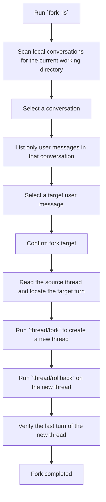

# Codex Any-Node Fork

中文说明: [README_CN.md](./README_CN.md)

A lightweight Windows command-line tool for browsing local Codex Desktop / Codex CLI conversations by working directory and creating a fork from any selectable conversation node.

## Features

- Filter local Codex conversations by the current working directory
- Navigate conversations with the keyboard
- Show only user messages as fork candidates
- Create a new branch thread with `fork + rollback`

## Requirements

- Windows
- Python 3.10+
- Codex Desktop or Codex CLI installed
- Access to a local Codex sessions directory

This project uses only the Python standard library.

## Quick Start

For first-time setup, beginners can run:

```powershell
.\add_to_user_path.cmd
```


Run:

```powershell
fork -ls
```


If the project directory is not in `PATH`, use:

```powershell
.\fork.cmd -ls
```

Or run the script directly:

```powershell
python .\scripts\fork_cli.py -ls
```

## Controls

- `↑ / ↓`: move selection
- `Enter`: confirm
- `Backspace`: go back
- `q`: quit

After entering a conversation, the tool shows only user messages.
Once a target message is selected, it creates a new thread and rolls that new thread back to the matching turn.

## Simplified Flow



## Project Structure

```text
.
├─ add_to_user_path.cmd
├─ fork.cmd
├─ LICENSE
├─ README.md
├─ README_CN.md
└─ scripts
   ├─ fork_cli.py
   └─ session_tool.py
```

## Notes

- The original thread is never modified
- Rollback is applied only to the new thread
- If the new thread does not appear immediately in Codex App, refresh or restart the app

## License

Licensed under the MIT License.
