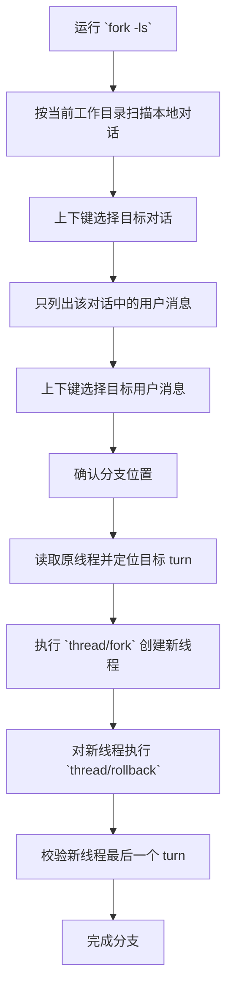

# Codex Any-Node Fork

English version: [README.md](./README.md)

一个面向 Windows 的轻量命令行工具，用于按当前工作目录浏览本地 Codex Desktop / Codex CLI 对话，并从任意可选对话节点创建分支线程。

## 功能

- 按当前工作目录筛选本地 Codex 对话
- 使用上下键选择目标对话
- 仅展示对话中的用户消息作为分支基准
- 对目标线程执行 `fork + rollback`

## 要求

- Windows
- Python 3.10+
- 已安装 Codex Desktop / Codex CLI
- 本地存在可访问的 Codex 会话目录

本项目只使用 Python 标准库。

## 快速开始

第一次使用时，可以先运行：

```powershell
.\add_to_user_path.cmd
```

直接运行：

```powershell
fork -ls
```

如果项目目录还没有加入 `PATH`，可以先这样运行：

```powershell
.\fork.cmd -ls
```

或者：

```powershell
python .\scripts\fork_cli.py -ls
```

## 交互方式

- `↑ / ↓`：切换选项
- `Enter`：确认
- `Backspace`：返回上一级
- `q`：退出

进入某个对话后，程序只显示用户消息。
选定目标消息后，会创建一个新线程，并将新线程回滚到该消息对应的 turn。

## 简化流程



## 项目结构

```text
.
├─ add_to_user_path.cmd
├─ fork.cmd
├─ LICENSE
├─ README.md
├─ README_CN.md
└─ scripts
   ├─ fork_cli.py
   └─ session_tool.py
```

## 说明

- 不会修改原线程
- 只会对新创建的线程执行 rollback
- fork 完成后，工具会先尝试通过 `thread/resume` 自动把新线程加载进 Codex
- 如果 Codex Desktop 正在运行，工具还会自动重启 App 来刷新线程列表
- 如果新线程仍然没有显示出来，再手动重新打开 Codex

## License

Licensed under the MIT License.
